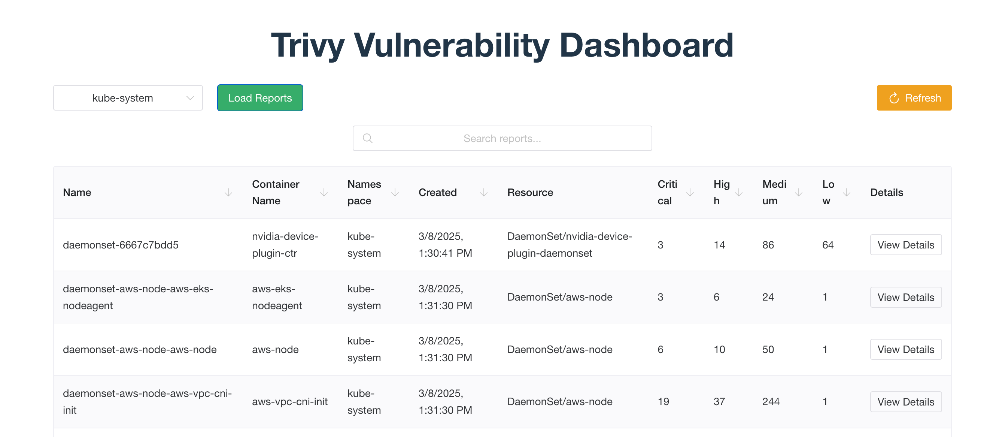
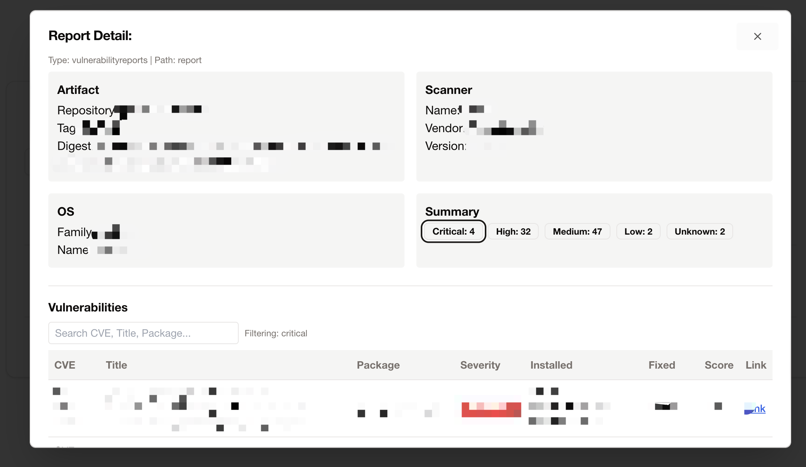

# Trivy UI Dashboard

A web-based UI for visualizing and managing Trivy vulnerability scan results in Kubernetes clusters.

## Overview
Trivy UI provides a centralized dashboard for viewing vulnerability reports generated by the Trivy Operator in Kubernetes environments. It offers an intuitive interface to browse, search, and analyze security vulnerabilities detected in your container images.

## Screenshots

### Dashboard Overview

*Main dashboard showing vulnerability statistics and summary*

### Vulnerability Report List

*Detailed list of vulnerability reports with filtering options*

### Report Details

*In-depth view of individual vulnerability reports*


## Features
- **Dashboard View**: Overview of vulnerability statistics across namespaces
- **Detailed Reports**: In-depth analysis of vulnerabilities by severity  
- **Search & Filter**: Quickly locate specific vulnerability reports
- **Caching**: Optimized performance with disk-persistent caching
- **Responsive Design**: Works on desktop and mobile devices

## Architecture
The application consists of two main components:

- **Frontend**: Vue 3 single-page application with Vite
- **Backend**: Go server that interfaces with the Kubernetes API

```
trivy-ui/
├── go-server/         # Go backend application
│   ├── api/           # API handlers
│   ├── cache/         # Caching functionality
│   └── kubernetes/    # Kubernetes client interface
└── my-trivy-dashboard/   # Vue 3 frontend
    └── src/           # Frontend source code
```

## Prerequisites
- Go 1.19+
- Node.js 16+ 
- Access to a Kubernetes cluster with Trivy Operator installed
- kubectl configured with appropriate permissions

## Installation
### Build from Source
1. Clone the repository
```shell
git clone https://github.com/locustbaby/trivy-ui.git
cd trivy-ui
```
2. Build and run the frontend
```shell
cd trivy-dashboard
npm install
npm run build
```
3. Build and run the backend server
```shell
cd ../go-server
go build
./go-server
```
4. Access the dashboard at http://localhost:8080

## Environment Variables
The server can be configured using the following environment variables:

| Variable | Description | Default |
|----------|-------------|---------|
| PORT | HTTP port to listen on | 8080 |
| DEBUG | Enable debug logging | false |
| CACHE_PATH | Path to save cache data | trivy-cache.dat |
| CACHE_INTERVAL | How often to save cache to disk in minutes | 2 |
| STATIC_PATH | Path to static frontend assets | ../trivy-dashboard/dist |
| KUBECONFIG | Path to Kubernetes config file | ~/.kube/config |

## Development

### Backend (Go)
The backend server provides APIs for accessing Trivy vulnerability reports from Kubernetes.
```shell
cd go-server
go run main.go
```

### Frontend (Vue 3)  
For frontend development with hot reload.
```shell
cd trivy-dashboard
npm run dev
```

## API Endpoints
- `GET /namespaces`: List all Kubernetes namespaces
- `GET /vulnerability-reports`: Get vulnerability reports with pagination and filtering
- `GET /report-details`: Get detailed information about a specific vulnerability report 


## Contributing
Contributions are welcome! Please feel free to submit a Pull Request.

1. Fork the project
2. Create your feature branch (`git checkout -b feature/new-feature`)
3. Commit your changes (`git commit -m 'Add new feature'`)
4. Push to the branch (`git push origin feature/new-feature`)
5. Open a Pull Request

## License
This project is licensed under the MIT License - see the LICENSE file for details.

## Acknowledgments
- Trivy - The vulnerability scanner
- Trivy Operator - Kubernetes operator for Trivy
- Vue.js - Frontend framework
- Go - Backend language