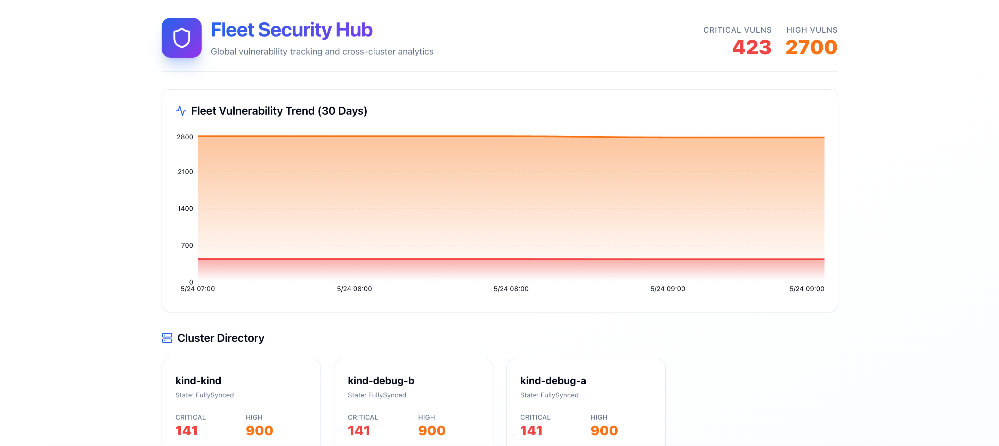
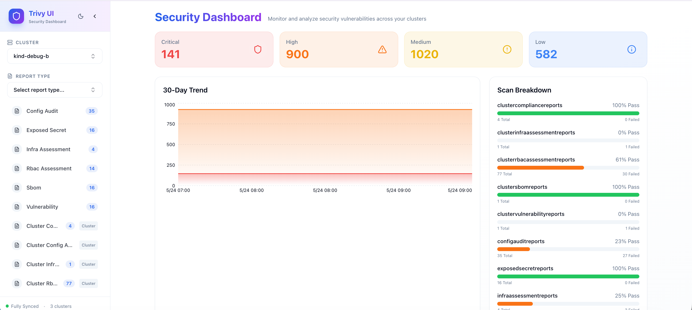
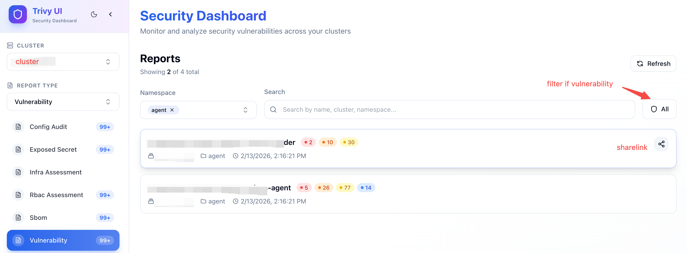
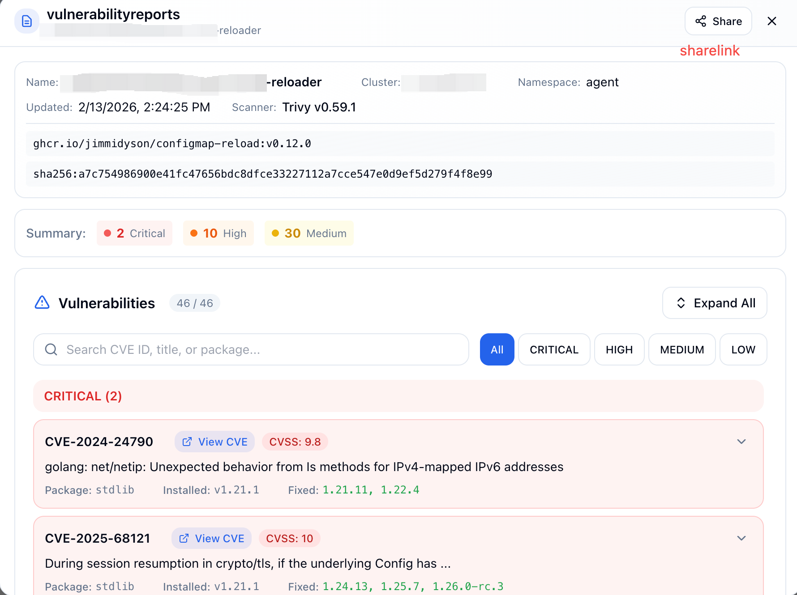

# Trivy UI Dashboard

A web-based UI for visualizing and managing Trivy vulnerability scan results in Kubernetes clusters.

## Overview
Trivy UI provides a centralized dashboard for viewing vulnerability reports generated by the Trivy Operator in Kubernetes environments. It offers an intuitive interface to browse, search, and analyze security vulnerabilities detected in your container images.

## Screenshots

### Fleet Hub


### Cluster Overview


### Reports Dashboard


### Report Details


---

## Quick Start with Docker Image

```shell
docker pull locustbaby/trivy-ui:v0.0.5

docker run -d \
  -v /path/to/your/kubeconfigs:/kubeconfigs \
  -e KUBECONFIG_DIR=/kubeconfigs \
  -p 8080:8080 \
  locustbaby/trivy-ui:v0.0.5
```
- Replace `/path/to/your/kubeconfigs` with the directory containing your kubeconfig files. Every context in each file is initialized as a separate cluster.
- Access the dashboard at http://localhost:8080

---

## Run in Kubernetes

### Using Helm Chart (Recommended)

```bash
# Install directly from Docker Hub OCI registry
helm install my-trivy-ui oci://registry-1.docker.io/locustbaby/trivy-ui

# Or from GitHub Pages
helm repo add trivy-ui https://locustbaby.github.io/trivy-ui/
helm repo update
helm install my-trivy-ui trivy-ui/trivy-ui

# Or from local chart
git clone https://github.com/locustbaby/trivy-ui.git
cd trivy-ui/charts/trivy-ui
helm install my-trivy-ui .
```

### Configure kubeconfigs for multi-cluster support

```bash
kubectl create secret generic kubeconfigs \
  --from-file=cluster1=/path/to/cluster1-kubeconfig \
  --from-file=cluster2=/path/to/cluster2-kubeconfig
```

### Customize the deployment

```bash
helm install my-trivy-ui oci://registry-1.docker.io/locustbaby/trivy-ui \
  --set ingress.enabled=true \
  --set ingress.hosts[0].host=trivy-ui.example.com
```

For detailed Helm chart documentation, see [charts/trivy-ui/README.md](charts/trivy-ui/README.md).
For the user-oriented installation, authentication, and access-control guide,
see [docs/README.md](docs/README.md).

---

## Features
- **Multi-Cluster Support**: View reports from multiple Kubernetes clusters via kubeconfig directory
- **Fleet Hub**: Start with a cross-cluster overview page when multiple clusters are available
- **Cluster Overview**: Drill into per-cluster severity trends, scan breakdowns, and vulnerable workloads
- **All Trivy CRD Types**: Auto-discovers all Trivy Operator CRDs (VulnerabilityReport, ConfigAuditReport, SbomReport, ExposedSecretReport, RbacAssessmentReport, InfraAssessmentReport, and their cluster-scoped variants)
- **Namespace Selector**: Multi-select namespace filtering with URL persistence
- **Vulnerability Filter**: Toggle to show only reports with vulnerabilities
- **Shareable Links**: Share filtered views and report details via URL
- **Quick Copy**: One-click copy for CVE IDs, package names, versions, image references, and more
- **Server-Side Pagination**: Efficient handling of large clusters with hundreds of reports
- **Search & Filter**: Filter by cluster, namespace, and search by report name
- **Detail View**: Full vulnerability/check details fetched on-demand
- **Disk-Persistent Cache**: Fast startup with cached data, background K8s sync
- **Real-time Updates**: Kubernetes informer-based watch for live report changes
- **Memory Optimized**: SetTransform strips large fields from informer store, detail data fetched on-demand
- **Responsive Design**: Works on desktop and mobile

## Architecture

- **Frontend**: React 19 + TypeScript + Vite + Tailwind CSS
- **Backend**: Go with Kubernetes dynamic client, informer-based caching

```
trivy-ui/
├── go-server/         # Go backend
│   ├── api/           # REST handlers, cache, cluster client
│   ├── config/        # CRD registry, app config
│   ├── kubernetes/    # K8s client, informer with SetTransform
│   └── main.go        # Entry point
├── trivy-dashboard/   # React frontend
│   └── src/
│       ├── api/       # API client
│       ├── components/# UI components
│       └── pages/     # Route pages
├── charts/            # Helm chart
│   └── trivy-ui/
└── Dockerfile         # Multi-stage build
```

### Data Flow
1. Backend discovers Trivy Operator CRDs via K8s API
2. Informers watch every discovered Namespaced and Cluster-scoped report type across each initialized cluster
3. List API serves paginated results from in-memory cache
4. Detail API fetches full report from K8s on-demand, caches with 5-10min TTL
5. Disk cache enables fast pod restarts without re-listing all resources

## Prerequisites
- Go 1.25+
- Node.js 23+
- Access to one or more Kubernetes clusters with Trivy Operator installed

## Development Setup

```shell
# Terminal 1: Backend
cd go-server && go run .

# Terminal 2: Frontend (proxies API to localhost:8080)
cd trivy-dashboard && npm install && npm run dev
```

Access the frontend dev server at http://localhost:5173

## Testing

Unit tests (pure Go, no cluster needed):

```shell
cd go-server && go test ./...
```

End-to-end tests run the real server against a [kwok](https://kwok.sigs.k8s.io)
cluster (a real kube-apiserver + etcd with fake nodes) seeded with hundreds of
synthetic report CRs. They verify pagination completeness, order stability
across refreshes, data correctness against ground truth read back from the API
server, filters and the error matrix. See `go-server/test/e2e/README.md` for
local instructions — CI runs them automatically in the `e2e-kwok` job.

## Configuration

### Cluster-wide collection and user scopes

The backend collects all discovered Trivy report types, including
Cluster-scoped reports. Helm creates a cluster-wide read-only `ClusterRole` for
the UI ServiceAccount. When local authentication is enabled, use `scopes` in
`auth.yaml` to limit each UI user's visible Clusters and Namespaces. Include
the special namespace `_` when that user should see Cluster-scoped reports.
Kubernetes RBAC limits the backend ServiceAccount; user scopes limit the
authenticated UI request.

### Environment Variables

| Variable         | Description                           | Default              |
|------------------|---------------------------------------|----------------------|
| `PORT`           | HTTP port                             | `8080`               |
| `LOG_LEVEL`      | Logging level (`debug`, `info`, `warning`, `error`) | `info` |
| `STATIC_PATH`    | Path to frontend assets               | `trivy-dashboard/dist` |
| `KUBECONFIG_DIR` | Directory containing kubeconfig files | `/kubeconfigs`       |
| `DATA_PATH`      | Directory for cache persistence       | `/tmp/trivy-ui-data` |
| `CORS_ALLOWED_ORIGINS` | Comma-separated browser origins. Exact origins enable credentialed cross-origin requests and use `SameSite=None` cookies by default | _(unset)_ |
| `AUTH_COOKIE_SAME_SITE` | Session-cookie policy: `lax`, `strict`, or `none`. Empty derives a safe default from CORS configuration; `none` requires `AUTH_COOKIE_SECURE=true` | `lax` |
| `ERROR_PAGE_CONFIG` | Structured JSON (`{"title","message","items":[{"type":"email\|link","label","value"}]}`) for the support page shown on auth/access/availability errors. Rendered natively by the UI; preferred over `ERROR_PAGE_FILE` | _(unset)_ |
| `ERROR_PAGE_FILE`| Path to an operator-provided HTML file served publicly at `/error-page.html` — escape hatch for fully custom branding. Hot-reloaded on change; rendered with the same trust level as the app itself, so never point it at user-writable storage | _(unset)_ |

#### Custom error page (Kubernetes / Helm)

The recommended way is structured config in Helm values — no HTML required:

```yaml
customErrorPage:
  enabled: true
  title: "Security dashboard unavailable"
  message: "Contact the platform team for help:"
  items:
    - type: email
      label: Email
      value: sec-platform@example.com
    - type: link
      label: On-call chat
      value: https://chat.example.com/platform-oncall
    - type: link
      label: Runbook
      value: https://wiki.example.com/trivy-ui/runbook
```

Edit `values.yaml` (or a custom values file) and run `helm upgrade` to apply.

A ready-to-use raw-HTML template lives at [`examples/error-page.example.html`](./examples/error-page.example.html) for the `ERROR_PAGE_FILE` escape hatch:

```shell
docker run -d -v /path/to/error-page.html:/app/error-page.html:ro \
  -e ERROR_PAGE_FILE=/app/error-page.html -p 8080:8080 locustbaby/trivy-ui:v0.0.5
```

### Error Codes

Every API error response carries a machine-readable code in `error.type`, plus
the `X-Request-ID` header value in `error.requestId` for log correlation:

```json
{"code":1,"message":"report access denied","error":{"type":"ACCESS_DENIED","requestId":"..."}}
```

| Code | Meaning |
|------|---------|
| `INTERNAL_ERROR` | Unexpected server-side failure |
| `VALIDATION_FAILED` | Invalid request parameters |
| `AUTH_REQUIRED` | Not authenticated (session missing/expired) or login rejected |
| `ACCESS_DENIED` | Authenticated but outside namespace/cluster scope |
| `REPORT_NOT_FOUND` | Report does not exist |
| `REPORT_AMBIGUOUS` | Reference matches multiple reports; narrow the query |
| `PROVIDER_UNAVAILABLE` | Cluster client unavailable or upstream fetch failed |
| `DATA_INCOMPLETE` | Cache capacity exceeded; data may be partial |

## API Reference

### V1 Endpoints

| Method | Path | Description |
|--------|------|-------------|
| `GET` | `/api/v1/report-types` | List discovered report types |
| `GET` | `/api/v1/reports?type={type}` | List reports by type (paginated) |
| `GET` | `/api/v1/reports/{cluster}/{type}/{namespace}/{name}` | Get full report details; use `_` for Cluster-scoped reports |
| `GET` | `/api/v1/clusters` | List accessible clusters |
| `GET` | `/api/v1/clusters/{cluster}/namespaces` | List accessible namespaces |
| `GET` | `/api/cache/stats` | Cache statistics when local auth is disabled |
| `GET` | `/healthz` | Health check |
| `GET` | `/readyz` | Readiness check |

### Query Parameters for list endpoint

| Parameter | Description | Example |
|-----------|-------------|---------|
| `cluster` | Filter by cluster | `?cluster=prod` |
| `namespace` | Filter by one or more namespaces | `?namespace=team-a,team-b` |
| `search` | Search report name, cluster, namespace or artifact | `?search=nginx` |
| `onlyVulnerable` | Include only reports with findings | `?onlyVulnerable=true` |
| `page` / `pageSize` | Pagination controls | `?page=2&pageSize=50` |

## License

MIT
