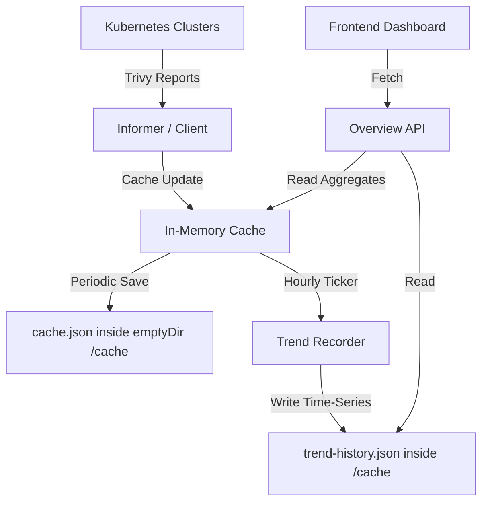

# Multi-Cluster Security Dashboard & Trend Analysis Design Proposal

This document outlines the design and implementation proposal for a unified, multi-cluster home dashboard in `trivy-ui`, resolving the requirements highlighted in [Issue #10](https://github.com/locustbaby/trivy-ui/issues/10).

---

## 1. Requirement Summary

The objective is to transform `trivy-ui` from a single-report browser into a comprehensive Kubernetes security posture dashboard without compromising its lightweight nature:

1. **Global Overview (Home Dashboard)**: A landing view when no specific report type is selected.
2. **Multi-Cluster Adaptive Support**: Dynamically switch between global multi-cluster health and single-cluster granular metrics.
3. **All Types Comprehensive Observation**: Cross-analysis of Vulnerability, Config Audit, RBAC, and Secret reports.
4. **Historical Trend Analysis**: A 30-day time-series history of security posture without introducing database dependencies.

---

## 2. UI/UX & Interaction Flow

The UI strictly follows a "Overview -> Locate -> Details" drill-down flow to ensure zero impact on existing correctness and a seamless user experience.

### 2.1 Default State (Global Landing)
* **Sidebar**: A new top item `🏠 Overview` is highlighted. No specific Report Type is selected.
* **Main View**: 
  * **Global Aggregates**: 🔴 Critical / 🟠 High / 🟡 Medium / 🔵 Low totals across all clusters.
  * **Trend Chart**: 30-day area chart of cross-cluster vulnerabilities.
  * **Cluster Leaderboard**: List of clusters with their Health Grades and Sync States.
* **Interaction**: Clicking a cluster in the leaderboard updates the URL to `/?cluster=<name>` and smoothly transitions the main view to the Single-Cluster Dashboard.

### 2.2 Single-Cluster State
* **Sidebar**: Cluster selector displays the chosen cluster.
* **Main View**:
  * Metrics and Trend Chart auto-filter to the selected cluster.
  * **Namespace Risk Leaderboard**: Replaces the Cluster Leaderboard. Shows progress bars of risk density per namespace.
  * **Top Vulnerable Workloads**: Top 5 critical resources in the cluster.
* **Interaction**:
  * Clicking a Namespace (e.g., `kube-system`) navigates to `/?cluster=<name>&type=VulnerabilityReport&namespace=kube-system`.
  * Clicking a Top Workload slides out the existing `ReportDetails` side panel, keeping the user in the context of the dashboard.

### 2.3 Report Type Navigation
* Selecting a specific report type (e.g. `VulnerabilityReport`) exits the dashboard and renders the standard `ReportsList` table.
* The table namespace filter incorporates an `All Namespaces` option for cross-namespace querying.

---

## 3. Architecture & Data Flow



---

## 4. Backend Implementation Design (go-server)

### 4.1 Overview API (`/api/v1/overview`)

A polymorphic endpoint returning aggregated metrics. If `cluster` is omitted, it returns global stats; if provided, it returns single-cluster stats.

* **Path**: `/api/v1/overview`
* **Query Params**: `cluster` (optional)
* **Response Payload (`ClusterOverview`)**:
```json
{
  "total_reports": 187,
  "severity_totals": { "critical": 14, "high": 45, "medium": 210, "low": 540 },
  "scan_types_breakdown": {
    "VulnerabilityReport": { "scanned": 120, "failed": 45, "critical": 10 },
    "ConfigAuditReport": { "scanned": 50, "failed": 5, "critical": 2 }
  },
  "top_vulnerable_workloads": [
    { "cluster": "kind-kind", "namespace": "demo-security", "name": "vuln-demo", "type": "VulnerabilityReport", "critical": 8, "high": 12 }
  ],
  // Returned when ?cluster= is omitted:
  "vulnerable_clusters": [
    { "name": "prod-k8s", "critical": 10, "high": 15 }
  ],
  // Returned when ?cluster= is provided:
  "vulnerable_namespaces": [
    { "name": "kube-system", "critical": 8, "high": 5 }
  ]
}
```

### 4.2 Time-Series Trend Recorder

* **Storage Path**: `/cache/trend-history.json` (inside the existing `emptyDir` volume).
* **Interval**: Every 1 hour. A 30-day window (720 points) consumes minimal memory/disk footprint (<50KB).
* **Crash-Survival**: Data is saved to the helm chart's `emptyDir` mount, surviving container restarts and OOM crashes.
* *Note: Data abstraction to external storage is intentionally deferred to maintain the tool's lightweight, zero-dependency nature.*

---
