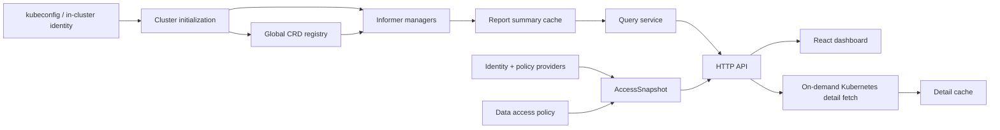

# 前后端、多集群与数据正确性评审

## 评审信息

- 日期：2026-08-20
- Git 基线：`87b7848 feat: add static auth and namespace access controls`
- 范围：Go 后端、React 前端、Kubernetes informer、缓存、静态认证与 Scope ACL、Helm、CI
- 验证：`npm run build` 通过；`npm run lint` 有 15 个错误；当前环境缺少 Go 和 Helm，尚未运行 Go test、race test、gofmt 和 Helm template

## 总体结论

当前实现的核心模型是合理的：Report 身份包含 `(cluster, namespace, type, name)`，用户权限和数据源权限在读取时求交集，列表在分页前过滤权限，详情也在读取缓存和 Kubernetes 前检查权限。这些原则适合多 Cluster、多 Namespace 的只读场景。

当前主要风险不在 ACL Matcher 本身，而在它上下游的身份一致性和数据生命周期：

1. Cluster 别名和实际 Kubernetes 客户端可能不一致。
2. 远程 kubeconfig 在 Pod 中会被忽略。
3. CRD 能力被建模成全局状态，但真实能力属于每个 Cluster。
4. 缓存、趋势和前端异步请求存在数据过期、错序或错误聚合风险。
5. Namespace 限制模式的 informer 数量按 `Cluster × Namespace × ReportType` 增长。
6. 全局单例和字符串主键让权限、缓存、数据源边界难以单独测试。

在这些问题修复前，适合做界面和单集群功能测试，不适合用多租户生产数据验证权限边界。

## 当前数据流



需要长期保持的正确性不变量：

- Cluster alias 必须唯一、稳定，并且准确指向实际 Kubernetes 凭据。
- Report 的唯一身份必须始终是结构化的 `(cluster, namespace, type, name)`。
- 所有列表、统计、趋势和详情都必须使用同一个最终权限：`source scope ∩ user scope`。
- 缓存命中不能绕过权限；缓存淘汰或同步失败不能让已删除对象无限期可见。
- 同名 Namespace 和同名 Report 在不同 Cluster 之间不能合并。
- 前端旧请求不能覆盖较新的 Cluster、Namespace 或搜索条件结果。

## P1：合并或生产验证前处理

### REV-BE-001：Pod 内远程 kubeconfig 被忽略

`go-server/kubernetes/client.go:66` 只要发现 `KUBERNETES_SERVICE_HOST` 就使用 `rest.InClusterConfig()`，即使调用方已经传入远程 kubeconfig 路径。

影响：

- Helm 部署后所有远程 Cluster alias 实际可能连接当前集群。
- 当前集群数据可能以远程 alias 写入缓存。
- User Scope 针对 alias 的授权不再对应真实数据源，形成租户边界错误。

建议：

- 当且仅当 kubeconfig 路径为空时使用 InClusterConfig。
- 引入显式 `ClusterSource{Alias, KubeconfigPath, InCluster}`，不要在 Client 内通过环境变量重新决定来源。
- 增加测试：设置 `KUBERNETES_SERVICE_HOST` 后传入远程 kubeconfig，确认仍使用远程配置。

### REV-BE-002：Cluster alias 解析不稳定且不检测碰撞

`go-server/main.go:101` 从 `rawConfig.Clusters` map 中取第一个名称；Kubernetes 客户端实际使用的却是 `CurrentContext`。map 顺序不稳定，而且 `/`、`:` 截断后可能产生相同 alias。

影响：

- DataAccess 配置可能匹配错误 Cluster。
- 两个真实 Cluster 可能共用一个缓存前缀，Report 和 Namespace 被合并。
- 同名 Namespace 隔离即使 Matcher 正确，也会在错误 alias 上失效。

建议：

- 用 `CurrentContext -> Context.Cluster` 解析真实 cluster name。
- 更推荐由运维显式配置稳定 alias，文件名只作为默认值。
- 初始化前建立 alias 集合，遇到重复直接启动失败。
- 缓存中保存 alias 与 API server fingerprint 的绑定，启动时发现变化应清理旧数据或 fail closed。

### REV-BE-003：CRD Registry 不应该是全局单例

当前只使用第一个 Cluster 发现 CRD，所有 Cluster informer 和详情查询共享 `config.GetGlobalRegistry()`。

影响：

- Cluster A 与 Cluster B 的 Trivy Operator 版本、CRD 类型或 API version 不同时，部分报告会缺失或请求错误 GVR。
- 新增 CRD 后 Registry 可以刷新，但已经启动的 informer 不会随之创建。
- `/api/v1/type` 展示的是第一个 Cluster 的能力，而不是当前选择 Cluster 的能力。

建议：

- 将报告能力放入 `ClusterRuntime`：`Alias + Client + ReportCatalog + Informers + SyncState`。
- API 的 ReportType 列表按选中 Cluster 返回；全局页面可返回各 Cluster 能力的并集，并标记可用 Cluster。
- Report detail 通过目标 Cluster 的 ReportCatalog 解析 GVR。

### REV-AUTH-001：Cluster 可见性没有计算 User 与 Source 的真实交集

`auth.AccessSnapshot.CanReadCluster` 只分别检查 User 和 Source 是否包含 Cluster，没有判断 Namespace 规则是否重叠。

示例：

```text
User scope:   cluster-a/ns-a
Source scope: cluster-a/ns-b
```

这种情况下 Cluster 列表仍会包含 `cluster-a`，并暴露 API Server URL 和版本，但最终没有任何可读 Namespace。

建议为 ScopeSnapshot 增加语义级交集能力，而不是依赖两个独立布尔值：

```go
type AccessEvaluator interface {
    CanRead(ReportRef) bool
    CanSeeCluster(cluster string) bool
    VisibleNamespaces(cluster string, candidates []string) []string
    Fingerprint() string
}
```

`CanSeeCluster` 至少需要验证双方规则在 Namespaced 或 Cluster-scoped 维度上存在交集。

### REV-HELM-001：existing kubeconfig Secret 不会挂载

`charts/trivy-ui/templates/deployment.yaml` 把 Secret 的创建和挂载都放在 `kubeconfigs.create` 条件下。文档要求手工创建 Secret 时设置 `create=false`，结果 Deployment 不再挂载它。

建议：

- `kubeconfigs.create` 只控制 `templates/secret.yaml`。
- Deployment 是否挂载由独立的 `kubeconfigs.enabled` 或非空 `secretName` 控制。
- Helm 测试至少覆盖 create=true、existing Secret、禁用 kubeconfig 三种情况。

### REV-CACHE-001：完整 Report Detail 被持久化到 0644 文件

完整详情使用 `detail:` key 写入统一缓存，`SaveToFile` 又序列化全部有效缓存项。Vulnerability、ExposedSecret、ConfigAudit 等完整报告可能进入 `/cache/cache.json`，文件权限为 `0644`。

建议：

- `cache.json` 只允许 `cluster:`、`namespace:` 和摘要 `report:` key；Detail 不再进入统一 Summary Snapshot。
- Detail 默认进入独立、有界、可过期的 `detail-cache.json`，也可以通过 `persist=false` 仅使用内存缓存。
- Detail 文件权限固定为 `0600`，并通过同目录临时文件加 `rename` 原子写入；详情重启恢复后必须标记为 `stale`。

## 数据正确性

### REV-DATA-001：受限用户 Trends 只是过滤，没有重新聚合

Trend 文件已经按 Namespace 保存记录，但 `getTrendsForScope` 只过滤可读 Namespace，然后直接返回。用户有多个 Namespace 时，同一 timestamp 会返回多个点；前端直接逐条绘制，因此曲线不是授权范围的总量。

建议：

- 后端按 timestamp 聚合授权后的 Namespace 记录。
- Cluster 查询按 `(timestamp, cluster)` 聚合；全局查询按 timestamp 聚合全部授权 Cluster/Namespace。
- 统一时间 bucket，避免进程重启或记录时刻偏移产生多个近似时间点。

### REV-DATA-002：Namespace 模式的缓存校验找不到 informer

受限模式 informer key 是 `namespace + NUL + reportType`，但 `ValidateAndCleanup` 按纯 `reportType` 查找。Namespace 模式下会跳过旧 Report 的存在性检查。

同时 Report 在 `Cache.Get` 和 `Cache.Items` 中被特殊处理为忽略 expiration。若 Delete event 丢失，旧报告可能持续显示到进程重启或 Ristretto 真正触发淘汰。

建议：

- 使用结构化 `InformerKey{Namespace, ReportType}`，校验时按同一类型定位。
- 明确定义缓存状态：`Fresh`、`Stale`、`SourceUnavailable`，不要把缓存数据默认描述为实时数据。
- Report TTL 到期后应 fail stale 或标记 stale，不应无条件返回。
- Delete handler 支持 `cache.DeletedFinalStateUnknown` tombstone。

### REV-DATA-003：旧版详情 API 在重名 Report 下结果不确定

`/api/v1/type/{type}/{name}` 没有 Cluster 和 Namespace，后端遍历 map 选择第一个授权匹配项。多个 Cluster 或 Namespace 存在同名 Report 时，返回结果取决于 map 遍历顺序。

前端已经使用包含完整身份的新路由，这是正确方向。建议弃用旧详情 API；如果继续保留，重名时返回 `409 Ambiguous`，不要随机选择。

### REV-FE-001：旧异步请求可以覆盖新筛选结果

`ReportsList.fetchReports` 只防止完全相同的 request key 重复执行，没有 AbortController 或递增 request generation。用户快速切换 Cluster、Namespace 或搜索条件时，旧请求可能晚于新请求完成，并再次调用 `setReports`。

影响：UI 可能短暂或持续展示不属于当前筛选条件的数据。后端权限仍然生效，因此这通常不是越权，但会破坏多 Cluster/Namespace 数据可信度。

建议：

- 每次查询条件变化取消前一个请求。
- 响应落地前比较 generation 或规范化 query key。
- 将 URL 查询参数作为唯一数据源，减少 URL、local state、localStorage 三套状态互相同步。

### REV-FE-002：前端 Report 去重键仍是易碰撞字符串

无限滚动合并页数据时使用 `${cluster}-${namespace}-${name}`。Cluster alias、Namespace 和 Report name 都可能包含 `-`，不同元组可以产生相同字符串并误删 Report。

建议引入统一函数：

```ts
function reportIdentity(report: Report): string {
  return JSON.stringify([report.cluster, report.namespace, report.type, report.name])
}
```

后端缓存 key 也应采用结构化 key 或可靠编码，避免 Cluster alias 中的 `:` 破坏 Split 解析。

### REV-FE-003：CSS Token 与 Tailwind 颜色硬编码脱节，图表缺乏深色模式联动

`index.css` 中定义了完整的 HSL 色彩变量（`--primary`、`--severity-critical`、`--severity-high` 等），但大部分视图（`OverviewDashboard`、`GlobalHub`、`SummaryCard`）直接硬编码了 `text-red-500`、`bg-red-500/10`、`text-orange-500`。同时 Recharts 面积图在 `GlobalHub` 和 `OverviewDashboard` 中硬编码了十六进制 `#ef4444` 与 `#f97316`。

影响：深浅色模式切换时，硬编码颜色对比度失调；无法统一全局设计系统主题色与品牌色。

建议：

- 在 `tailwind.config.js` 中将严重级别收敛为系统语义 Token（`colors.severity.critical` 等）。
- 统一 Recharts 图表主题色彩映射表，动态读取 CSS 变量或主题常量。

### REV-FE-004：主题状态与 Sidebar 强耦合且存在 Effect 同步 setState 风险

深浅色模式切换逻辑（包括 `localStorage` 存取和 DOM `classList` 操作）硬编码在 `sidebar.tsx` 内部，且在 `useEffect` 中直接调用 `setIsDark(true)`，触发了 ESLint `react-hooks/set-state-in-effect` 规则报错（级联重新渲染）。

影响：在未挂载 Sidebar 的视图（如独立登录页 `LoginPage`、全屏 `GlobalHub`）中无法独立管理和切换主题；且 Effect 同步 setState 影响渲染性能。

建议：

- 抽取独立的 `ThemeProvider` 上下文与 `useTheme` Hook，提升至 `App` 顶层统一管理。
- 修复状态初始化逻辑，优先在状态初始函数中读取 `localStorage` / `prefers-color-scheme`，消除 Effect 内的同步 `setState`。

### REV-FE-005：详情视图居中 Modal 空间受限、长列表局促且易误触关闭

`ReportDetails.tsx` 使用居中 Modal 浮层（`max-w-4xl max-h-[90vh]`）。当某 Workload 包含上百个 CVE 或合规性 Checks 时，内嵌滚动区域高度有限，阅读长文本描述和修复建议较为局促；且点击黑色遮罩背景会直接关闭弹窗，用户划词选中文本时极易误触关闭。

建议：

- 升级为右侧滑出的 **Drawer / Sheet 抽屉**，并提供全屏展开切换按钮（⛶），在宽屏下保留左侧列表上下文。
- 增强防误触控制：仅点击 `Esc` 或右上角关闭按钮时关闭，遮罩点击需防文本选择误触。

### REV-FE-006：漏洞排查缺乏“仅看可修复 (Fixable Only)”与多维排序

`VulnerabilitySection.tsx` 目前仅提供基础的严重级别 Tab 筛选与模糊文本搜索。在实际运维场景中，安全和研发人员最迫切的需求是筛选出已有官方修复补丁（`fixedVersion` 存在）的 CVE 立即处置。

建议：

- 增加 **“Fixable Only (仅看可修复)”** 快捷切换开关。
- 增加按 CVSS 分值、发布时间、受影响包名进行客户端升降序排序。
- 支持 CVE 列表与受影响包名一键批量复制/导出，便于提单与汇报。

### REV-FE-007：已实现的 Skeleton 骨架屏组件未接入实际页面导致 CLS

`ui/skeleton.tsx` 中已经定义了结构完整的 `ReportsListSkeleton` 和 `ReportDetailsSkeleton`，但在 `ReportsList.tsx` 和 `ReportDetails.tsx` 实际页面中，依然在使用生硬的 Spinner（`Loader2`），导致页面初次加载时布局产生严重抖动（Cumulative Layout Shift）。

建议：

- 全面接入已有 Skeleton 骨架屏，替代简单 Spinner，保障加载过程的视觉平滑过渡。

### REV-FE-008：Combobox / MultiCombobox 下拉定位无碰撞检测与标签溢出

`combobox.tsx` 与 `multi-combobox.tsx` 使用简单的 CSS `absolute mt-1` 定位，无视口底部防遮挡与碰撞检测，在靠近页面底部或容器 overflow 时容易被截断；且 `MultiCombobox` 选中过多 Namespace 时会垂直撑开父容器高度，破坏顶部栏布局。

建议：

- 多选标签超过限制时折叠展示（如 `kube-system, default +4 more`），并提供一键清空/全选按钮。
- 下拉弹层支持浮动层视口避让（或引入 `@floating-ui/react`）。

### REV-FE-009：通用逻辑缺乏抽象且嵌套声明组件违背 React 规范

当前前端存在多处重复实现与代码规范违规：

1. **`ReportInfoCard.tsx:56` 在组件 render 阶段内联声明 `CopyableField`**：触发 ESLint `react-hooks/static-components` 致命错误（每次渲染都会销毁并重建子组件实例，重置内部状态）。
2. **复制与反馈逻辑重复**：`ReportInfoCard`、`ReportsList`、`VulnerabilitySection` 三处各自定义了一套 `copiedField` 状态与剪贴板写入逻辑。
3. **工具函数重复**：`formatTypeName` 在 `sidebar.tsx` 与 `ReportDetails.tsx` 重复定义。
4. **防抖 Hook 未复用**：已有 `hooks/useDebounce.ts`，但在 `ReportsList.tsx` 中却手动用 `useRef` + `setTimeout` 重新实现了防抖。
5. **Fast Refresh 规范违规**：`button.tsx` 中同时导出组件和 `buttonVariants` 常量，违反 `react-refresh/only-export-components`。

建议：

- 封装全局 `<CopyButton text="..." />` / `<CopyableText />` 独立 UI 组件。
- 将 `formatTypeName` 提取到 `lib/utils.ts`。
- 将 `buttonVariants` 移出或单独导出，修复全部 15 个 ESLint 错误。

### REV-FE-010：超大报告列表缺乏虚拟滚动（Virtualization）

在大型集群中，单个报告（如集群范围的 `ConfigAuditReport` 或核心组件的 `VulnerabilityReport`）可能包含数百至上千条条目。当前 DOM 采用全量渲染，在展开/折叠或频繁搜索过滤时存在明显的 DOM 重绘开销与卡顿。

建议：

- 在 `VulnerabilitySection` 和 `ReportsList` 引入虚拟列表（如 `@tanstack/react-virtual`），仅渲染可视区域节点。

### 当前多 Cluster、多 Namespace 展示中正确的部分

- Report API 和新详情 URL 都携带 Cluster 与 Namespace。
- Cluster-scoped Report 使用 `_` 作为 URL 表示，进入 Matcher 前恢复为空 Namespace。
- Namespace 列表按 Cluster 获取；前端 localStorage key 也包含 Cluster。
- 列表权限过滤发生在搜索、统计和分页之前。
- 同名 Namespace 在不同 Cluster 下由后端二元匹配，不会仅按 Namespace 授权。
- Overview 从授权后的 Report 重新聚合，没有直接复用全局统计。

## 性能与容量

### REV-PERF-001：Informer 数量按 `C × N × T` 增长

当前循环在每个 ReportType、每个 Namespace 中创建一个新的 DynamicSharedInformerFactory。

若有 10 个 Cluster、50 个 Namespace、10 个 ReportType，会创建约 5000 个 informer/watch。每个 informer 还有独立 reflector、store、同步 goroutine 和重连行为。

建议：

- Cluster 模式：每个 Cluster 一个 factory，在其上注册全部 GVR。
- Namespace 模式：每个 `(Cluster, Namespace)` 一个 factory，在其上注册全部 namespaced GVR。
- 对 Cluster 初始化增加全局并发限制和启动进度。
- 给 watcher 数量、对象数量、同步时间和 watch error 增加指标。

### REV-PERF-002：Overview 和 Namespace 查询会复制并扫描整个缓存

`Cache.Items()` 会复制 items map，并对每个 item 再访问 Ristretto。Overview 每次扫描所有缓存项，Namespace 查询也扫描所有 namespace key。

建议维护只读索引：

```text
reportsByCluster
reportsByClusterNamespace
reportsByType
namespacesByCluster
```

Overview 可使用按 `(cluster, namespace, type)` 保存的增量摘要。Scope 查询只合并允许的 bucket，避免每个用户每次 O(total reports) 扫描。

### REV-PERF-003：Query result cache 无容量和 TTL

`queryResultCache` 是全局 `sync.Map`。不同搜索词、页码、Namespace 组合和 Scope fingerprint 都生成新 entry；Report 更新时又遍历全部 entry 删除某个 type。

风险：

- 高频搜索或大量不同 Scope 会持续增加内存。
- 每次 informer update 都可能执行 O(query cache size) 的清理。

建议使用有界 TTL cache。既然 key 已包含 type version，就不需要每次更新遍历删除所有旧 key；让旧版本按短 TTL 或容量策略淘汰即可。

### REV-PERF-004：前端轮询形成重复请求和 N+1 Trends

- Dashboard 每 30 秒刷新 Cluster 和 ReportType。
- 每 15 秒为每种 ReportType 请求一次 count。
- ReportsList 每 15 秒重新获取已加载全部页。
- GlobalHub 对每个 Cluster 单独请求 Trends；Cluster 数组刷新后会再次执行。

建议：

- 增加单个 `/overview/summary` 或 `/report-types/counts` 批量接口。
- Global Trends 返回 Cluster 分组，避免 N+1。
- 前端采用统一 query cache 和 stale time，页面不可见时停止所有轮询。
- 后续可通过一个轻量 change version endpoint 判断是否需要刷新大列表。

## 抽象与代码整洁度

### 做得较好的部分

- `IdentityProvider`、`PolicyProvider`、`SessionManager` 为 file 到 DB/OIDC 的演进保留了入口。
- `ScopeSnapshot` 负责规范化和 fingerprint，避免在 API handler 中散落 wildcard 逻辑。
- Handler 依赖 `CacheService` 和 `QueryService`，列表查询已经从 HTTP 解析中分离。
- Kubernetes Client 在 Namespace 模式二次检查 Namespace，形成 API 过滤之外的数据源防线。

### 需要继续收口的部分

#### 1. 全局单例绕过依赖注入

`globalCache`、Default ClusterRegistry、Global CRDRegistry、全局 queryResultCache 和 counters 同时存在。部分 handler 使用注入对象，异步详情刷新和 CacheUpdater 又回到全局函数。

建议构建显式 `Application` 对象统一持有依赖：

```go
type Application struct {
    Clusters ClusterRuntimeRegistry
    Reports  ReportRepository
    Auth     AuthService
    Access   AccessEvaluatorFactory
    Trends   TrendRepository
}
```

后台 goroutine 必须从 Application 获取依赖，避免测试时连接到另一个全局实例。

#### 2. Report 模型和摘要解析重复

`api.Report` 与 `kubernetes.Report` 重复；severity summary 在 Handler、Cache 和 Informer 中分别解析。不同路径支持的数字类型和数据形态略有差异，容易产生统计不一致。

建议：

- 定义领域模型 `ReportRef`、`ReportSummary`、`ReportDetail`。
- Kubernetes adapter 只负责把 unstructured 转为领域模型。
- 统计只消费强类型 `ReportSummary`，不再重复解析 `map[string]interface{}`。

#### 3. 字符串缓存 key 穿透所有层

当前大量代码依赖 `report:<cluster>:<namespace>:<type>:<name>` 并在不同位置重复 Split。Cluster alias 可以包含分隔符，解析规则也不完全一致。

建议内部使用结构体：

```go
type ReportRef struct {
    Cluster   string
    Namespace string
    Type      string
    Name      string
}
```

只有持久化边界负责稳定编码，例如 JSON、长度前缀或 URL-safe base64。

#### 4. 配置读取分散

基础配置、Auth、DataAccess 和 kubeconfig 环境变量分别在不同 package 和 main 中解析；部分非法值被静默降级，例如无效 `AUTH_COOKIE_SECURE` 会变成 false。

建议启动时一次性构建并验证强类型 AppConfig，后续组件不得直接读取环境变量。

#### 5. Provider 错误没有分类

未来切换 DB Provider 后，当前 `error` 无法区分密码错误、用户不存在、Provider 不可用和超时。Middleware 会把 Resolve 错误统一变成 401。

建议定义稳定错误语义，例如 `ErrInvalidCredentials`、`ErrSubjectNotFound`、`ErrProviderUnavailable`，分别映射为 401、401 和 503，并纳入 readiness。

#### 6. 前端领域类型过弱

Report data 广泛使用 `any`，CRD 不同类型的 detail shape 由组件临时判断。当前 lint 已经暴露这一问题。

建议 API 返回判别联合：

```ts
type ReportDetail =
  | VulnerabilityReportDetail
  | ConfigAuditReportDetail
  | ExposedSecretReportDetail
  | UnknownReportDetail
```

至少先以 `unknown` 替代 `any`，在一个 normalize 层完成类型收窄。

## 运维、HTTP 与 CI

- 登录接口缺少请求体上限和限流，bcrypt cost 12 可形成 CPU 压力。
- HTTP Server 没有 ReadHeaderTimeout、IdleTimeout 和优雅关闭。
- Session 只在前端启动时检查；运行中 401 不会触发回登录页。
- CI 在 pull_request 也执行 Docker push，但不运行 Go test、前端 lint 或 Helm 多模式模板测试。
- Dockerfile 已改为 `npm ci`；仍需在 CI 中执行实际镜像构建确认锁文件和 Docker 构建上下文一致。
- Chart appVersion、默认 image tag 和 README 示例版本存在漂移。

## 推荐改造顺序

### 第一阶段：确保身份与数据正确 & 消除前端规范报错（P1）

1. 修复远程 kubeconfig 选择逻辑。
2. 显式解析和校验唯一 Cluster alias。
3. 修复 Helm existing Secret 挂载。
4. 修复 AccessSnapshot Cluster 交集。
5. 禁止完整详情落盘。
6. 修复 Trends 聚合和前端旧请求覆盖问题（REV-FE-001）。
7. **修复前端全部 15 个 ESLint 错误**：消除 render 内声明组件反模式、Effect 同步 setState 风险、Fast Refresh 违规，抽取 `CopyButton` 与 `formatTypeName`（REV-FE-009）。

### 第二阶段：收口多集群抽象 & 前端体验重构（P2）

1. 引入 `ClusterRuntime`，每个 Cluster 持有自己的 Client、ReportCatalog、InformerManager 和状态。
2. 引入结构化 `ReportRef`，替换字符串 Split。
3. 引入 `ReportRepository`，统一列表、详情、索引和缓存生命周期。
4. 移除业务路径中的全局单例。
5. **前端 UI/UX 体验重构**：
   - 全面接入 `Skeleton` 骨架屏消除首屏抖动（REV-FE-007）。
   - 详情视图升级为右侧滑出 Drawer / Sheet 抽屉与全屏支持（REV-FE-005）。
   - 漏洞列表增加“仅看可修复 (Fixable Only)”开关与按 CVSS/包名排序（REV-FE-006）。
   - 抽取全局 `ThemeProvider` / `useTheme`，统一颜色 Token 与图表深色模式适配（REV-FE-003, REV-FE-004）。
   - 优化 Combobox 下拉定位与多选标签折叠（REV-FE-008）。

### 第三阶段：容量、可观测性与列表虚拟化（P2/P3）

1. 将 informer factory 数量降至 `C` 或 `C × N`。
2. 添加有界 Query cache 和聚合索引。
3. 合并前端轮询请求与批量接口支持（REV-PERF-004）。
4. 超长漏洞列表引入虚拟滚动 `@tanstack/react-virtual`（REV-FE-010）。
5. 增加每 Cluster 同步状态、最后事件时间、对象数量、watch error 和 stale 数据指标。

## 必要测试矩阵

### Cluster 身份

- Pod 环境下同时初始化 in-cluster 和两个远程 kubeconfig。
- kubeconfig 有多个 context 时，只使用 CurrentContext 指向的 Cluster。
- 两个来源解析为相同 alias 时启动失败。
- alias 包含 `:`, `/`, `-` 或 Unicode 时，ReportRef 编码仍可逆。

### 多 Cluster、多 Namespace 数据

- Cluster A/ns-x 与 Cluster B/ns-x 的同名 Report 独立展示。
- 同 Cluster 不同 Namespace 的同名 Report 独立展示和打开详情。
- 快速切换 Cluster/Namespace 时，旧请求不能覆盖新结果。
- informer delete、tombstone、断线重连和缓存过期后不显示幽灵 Report。
- Cluster 之间 CRD 版本或 ReportType 不同仍能正确展示。

### ACL 与数据源交集

- User A/ns-a 与 Source A/ns-b 时 Cluster 列表为空。
- User `*/ns-a` 与 Source A/ns-a 时只显示 A/ns-a。
- User `A/*` 与 Source A/ns-a/ns-b 时只显示 source 允许的两个 Namespace。
- `_` 与 `*` 不互相包含。
- 列表、Overview、Trends、Detail 对同一 ReportRef 得出相同授权结果。

### 性能基线

- 10 Cluster × 50 Namespace × 10 ReportType 下 watcher 数量符合预期上限。
- 10 万 Report 下列表 P95、Overview P95、内存占用和缓存命中率。
- 100 个不同 Scope、搜索和分页组合下 Query cache 有容量上限。
- 断开一个远程 Cluster 不阻塞其他 Cluster readiness 和查询。
- 1000+ CVE 大报告展开/折叠无掉帧卡顿（虚拟列表验证）。

### 前端交互、主题与规范

- Session 过期自动回到登录页，且清理旧敏感视图。
- 浅色/深色/系统跟随模式切换在各页面（包括独立登录页和全屏 Hub）生效且持久化无水合闪烁。
- 详情 Drawer 展开、收起、全屏切换平滑，选中文字时防遮罩误触关闭。
- “仅看可修复”与多条件过滤、排序联动结果准确。
- `npm run lint` 和 `npm run build` 0 错误 0 告警通过。

### 部署与 Helm

- Helm 覆盖 none/local 与 cluster/namespaces 的组合。
- existing kubeconfig Secret、existing auth Secret 和 Secret checksum rollout。
- PR 必须通过 Go test、race test、前端 lint/build、Helm lint/template 和镜像构建。
