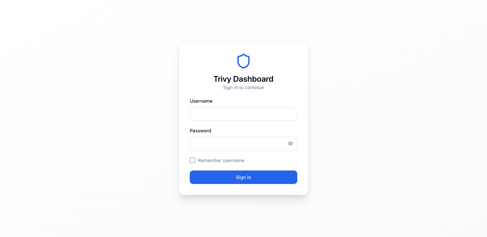

# Authentication and access control

## Enable local authentication

Authentication is disabled by default. Enable the local file backend with a
Secret containing `auth.yaml` and a session secret:

### 1. Generate password hash

Use the built-in CLI to hash a password:

```bash
# Using go directly
cd go-server
go run . hash-password

# Or using the Docker container
docker run -it --rm locustbaby/trivy-ui:v0.0.5 hash-password
```

> [!TIP]
> When generating passwords, type them interactively at the prompt to avoid shell history logging or escaping pitfalls (e.g. an unescaped `!` in `bash`/`zsh` that could alter the password string).

### 2. Prepare `auth.yaml`

Create an `auth.yaml` defining your users, password hashes, and scopes:

```yaml
version: v1
users:
  admin:
    passwordHash: "$2a$12$REPLACE_WITH_YOUR_BCRYPT_HASH"
    scopes:
      - cluster: "*"
        namespaces:
          - "*" # All Namespaced reports
          - _   # All Cluster-scoped reports
  developer:
    passwordHash: "$2a$12$REPLACE_WITH_YOUR_BCRYPT_HASH"
    groups:
      - dev-team
groups:
  dev-team:
    scopes:
      - cluster: prod
        namespaces:
          - team-a

```

### 3. Deploy to Kubernetes with Helm

Create the Secret containing the configuration and session encryption key:

```bash
kubectl create secret generic trivy-ui-auth \
  --from-file=auth.yaml=auth.yaml \
  --from-literal=session-secret="$(openssl rand -hex 32)"

helm upgrade --install trivy-ui oci://registry-1.docker.io/locustbaby/trivy-ui \
  --set auth.mode=local \
  --set auth.local.existingSecret=trivy-ui-auth
```

The Secret must contain the keys configured by `auth.local.configKey` (default: `auth.yaml`) and `auth.local.sessionSecretKey` (default: `session-secret`).

### 4. Run with Docker Standalone

When running Trivy UI as a standalone container:

```bash
docker run -d \
  --name trivy-ui \
  -v /path/to/kubeconfigs:/kubeconfigs \
  -v $(pwd)/auth.yaml:/etc/trivy-ui/auth/auth.yaml:ro \
  -e KUBECONFIG_DIR=/kubeconfigs \
  -e AUTH_MODE=local \
  -e AUTH_FILE_PATH=/etc/trivy-ui/auth/auth.yaml \
  -e AUTH_SESSION_SECRET="$(openssl rand -hex 32)" \
  -e AUTH_COOKIE_SECURE="false" \
  -p 8080:8080 \
  locustbaby/trivy-ui:v0.0.5
```

> [!IMPORTANT]
> If accessing Trivy UI over unencrypted HTTP (such as `http://localhost:8080`), set `AUTH_COOKIE_SECURE=false`. If accessing over HTTPS (via Ingress or reverse proxy), leave it as default `true` so browsers enforce secure cookie transmission.

### 5. Local Development (`go-server`)

To run the backend locally with authentication:

```bash
cd go-server
AUTH_MODE=local \
AUTH_FILE_PATH=../auth.yaml \
AUTH_SESSION_SECRET="$(openssl rand -hex 32)" \
AUTH_COOKIE_SECURE="false" \
go run .
```

## Environment variable reference

| Variable | Default | Description |
|---|---|---|
| `AUTH_MODE` | `none` | `none` (disabled) or `local` (file-backed authentication enabled) |
| `AUTH_LOCAL_BACKEND` | `file` | Storage backend for local authentication (`file`) |
| `AUTH_FILE_PATH` | `/etc/trivy-ui/auth/auth.yaml` | Filesystem path to the `auth.yaml` configuration file |
| `AUTH_SESSION_SECRET` | *(empty)* | 32+ byte secret used to sign and encrypt session cookies |
| `AUTH_SESSION_DURATION` | `12h` | Session validity duration (e.g. `12h`, `24h`, `7d`) |
| `AUTH_COOKIE_SECURE` | `true` | When `true`, session cookies require HTTPS. Set `false` for plain HTTP/localhost |
| `AUTH_COOKIE_SAME_SITE` | `lax` | Cookie SameSite policy: `lax`, `strict`, or `none` |


## Web UI login experience



When authentication is enabled, the Dashboard presents a dedicated login page:

- **Browser password manager support**: Uses standard HTML form and credential fields (`username`, `current-password`) so password managers (Chrome, Safari, 1Password, Bitwarden) securely prompt to save and autofill credentials.
- **Password visibility toggle**: Click the eye icon (`Eye` / `EyeOff`) to show or hide the entered password.
- **Remember username**: Check "Remember username" to save the username in `localStorage` for fast subsequent logins on that workstation.
- **Brute-force and timing protection**: The authentication backend uses bcrypt password verification with an in-flight concurrency limiter and constant-time dummy hashing for nonexistent accounts to prevent timing-based user enumeration.


## Scope syntax

Each scope matches a `(cluster, namespace)` pair:

| Scope | Meaning |
|---|---|
| `prod` + `team-a` | `team-a` in the `prod` cluster |
| `prod` + `*` | All Namespaced reports in `prod` |
| `*` + `team-a` | `team-a` in every cluster |
| `*` + `*` | All Namespaced reports in every cluster |
| `prod` + `_` | Cluster-scoped reports in `prod` |
| `*` + `_` | Cluster-scoped reports in every cluster |

The special namespace `_` means Cluster-scoped reports. Namespace `*` does not
include `_`; users who need both kinds of reports need both scope entries.
Partial wildcards such as `prod-*` are not supported.

## Users and groups

A user's effective scope is the union of their direct `scopes` and the scopes
of every group listed in `groups`:

```yaml
version: v1
users:
  alice:
    passwordHash: "..."
    groups: [developers]
    scopes:
      - cluster: prod
        namespaces: [team-a]
groups:
  developers:
    scopes:
      - cluster: staging
        namespaces: [shared]
```

This user can read `prod/team-a` and `staging/shared`. Group membership does
not replace direct scopes; the two sets are combined.

## What is protected

Scopes are applied to report lists, report details, cluster and Namespace
discovery, overviews, trends, and report-type metadata. A user with only a
Namespaced scope cannot see Cluster-scoped reports. A user with only `_` can
see Cluster-scoped reports but not Namespaced reports.

When local authentication is disabled (`auth.mode: none`), the Dashboard does
not perform user login or per-user scope checks. Kubernetes RBAC remains the
collector's boundary.

## Cluster-scoped report URLs

Use `_` in the Namespace URL segment for a Cluster-scoped report:

```text
/api/v1/reports/prod/clustervulnerabilityreports/_/cluster-report
```

The server normalizes `_` to an empty Kubernetes Namespace before querying the
cluster-scoped resource.

## Step-by-step usage walkthrough

### 1. Web UI sign-in
1. Open the Trivy UI URL in your browser (e.g. `http://localhost:8080`).
2. You will be presented with the login form. Enter your `username` and `password`.
3. Optionally click the **Eye** icon to verify your entered password.
4. Optionally check **Remember username** to save your username for future logins.
5. Your browser's built-in password manager or extension (Chrome, Safari, 1Password, Bitwarden) will prompt to save your credentials.

### 2. Scope enforcement in the Dashboard
- **Global Administrator** (`admin` with `namespaces: ["*", "_"]`):
  - Sees all clusters in the fleet, all namespaces, and all cluster-scoped audit reports (e.g. `ClusterCompliance`, `ClusterConfigAudit`).
- **Scoped User** (`developer` with `cluster: "prod"`, `namespaces: ["team-a"]`):
  - In the namespace dropdown, only `team-a` is visible.
  - The reports list only displays reports from `team-a` (e.g. `http://localhost:8080/?cluster=prod&type=configauditreports&namespace=team-a`).
  - Cluster-scoped reports are automatically hidden from the navigation bar.
  - Attempting to query unauthorized namespaces or clusters directly (via URL or API) will return a strict `403 ACCESS_DENIED` error.

### 3. Programmatic API access with cURL

```bash
# 1. Authenticate and save session cookie
curl -i -c cookie.txt -X POST http://localhost:8080/api/v1/auth/login \
  -H "Content-Type: application/json" \
  -d '{"username":"developer","password":"YourPasswordHere"}'

# 2. Access authorized report endpoints
curl -s -b cookie.txt 'http://localhost:8080/api/v1/reports?cluster=prod&namespace=team-a'

# 3. Unauthorized access will be rejected
curl -i -b cookie.txt 'http://localhost:8080/api/v1/reports?cluster=prod&namespace=kube-system'
# HTTP/1.1 403 Forbidden
# {"code":"ACCESS_DENIED","message":"access denied for namespace \"kube-system\""}

# 4. Check current user identity
curl -s -b cookie.txt http://localhost:8080/api/v1/auth/me

# 5. Log out
curl -i -b cookie.txt -X POST http://localhost:8080/api/v1/auth/logout
```


