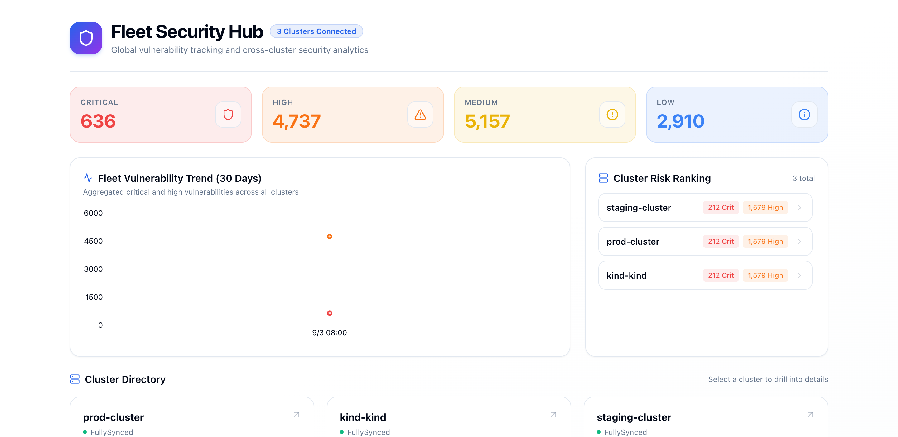

# Multi-cluster collection

## Collection flow

For every initialized cluster, Trivy UI:

1. Discovers Trivy Operator CRDs.
2. Starts cluster-wide informers for Namespaced and Cluster-scoped report types.
3. Stores report summaries in the local cache.
4. Fetches full report details from Kubernetes when requested.

The cache is an application-level aggregation layer. It is not a separate
Kubernetes tenant boundary.

## Kubernetes RBAC and remote clusters

The Helm chart's ClusterRole and ClusterRoleBinding apply to the ServiceAccount
in the installation cluster only. A remote kubeconfig uses its own identity,
so that identity must have equivalent permissions in the remote cluster.

The collector needs read-only access to:

- Trivy Operator report resources, including cluster-scoped variants;
- Trivy Operator CRDs for discovery;
- Namespaces for Namespace discovery;
- Kubernetes API discovery endpoints.

Example checks for a ServiceAccount are:

```bash
kubectl auth can-i list vulnerabilityreports.aquasecurity.github.io \
  --all-namespaces \
  --as=system:serviceaccount:trivy-ui:trivy-ui
kubectl auth can-i list clustervulnerabilityreports.aquasecurity.github.io \
  --as=system:serviceaccount:trivy-ui:trivy-ui
```

Use the actual namespace and ServiceAccount name from your deployment.

## Restricting Dashboard users

Kubernetes RBAC determines what the backend can collect. It does not know the
local users in `auth.yaml`. Once data is in the Dashboard cache, per-user
visibility is enforced by Dashboard scopes. Configure those scopes in
[Authentication and access control](02-authentication-and-access-control.md).

If strict data-at-rest isolation is required between tenants, deploy separate
Trivy UI instances with separate ServiceAccounts, credentials, and cache
storage. User scopes alone provide API/UI authorization, not separate storage.

## Cluster aliases

The cluster alias used in `clusterSources`, API URLs, and `auth.yaml` scopes
must be the same. Prefer explicit aliases for production deployments:

```yaml
clusterSources:
  prod:
    type: kubeconfig
    key: prod-kubeconfig
```

Then use `cluster: prod` in user scopes.

## Multi-cluster Web UI experience


When more than one cluster is initialized, the Trivy UI Dashboard activates full multi-cluster capabilities:

### 1. Fleet Hub (Cross-Cluster Overview)



When no specific cluster is selected in the URL (root navigation), the Dashboard displays **Fleet Hub**:
- **Global Vulnerability Trends**: 30-day cross-cluster critical and high severity timeline.
- **Cluster Directory Cards**: Visual cards for every cluster displaying its sync state (`Fully Synced`), total critical and high counts, and a mini-sparkline trend.
- **Direct Drill-down**: Clicking any cluster card instantly switches the view to that cluster's dashboard.


### 2. Sidebar Cluster Switcher
A persistent dropdown at the top of the sidebar enables switching between:
- `🌐 All Clusters` (returns to Fleet Hub)
- Individual clusters (e.g. `prod`, `staging`, `dev`)

### 3. Cluster Badges on Report Cards
In multi-cluster environments, report cards in the list view display their origin cluster name (`[prod]`) with a one-click copy button, allowing operators to quickly identify which Kubernetes cluster contains the vulnerable resource.


