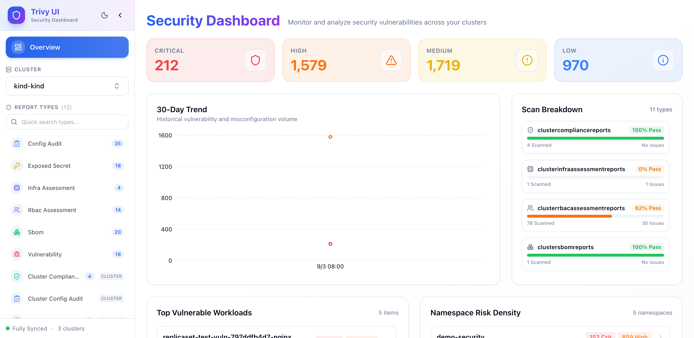
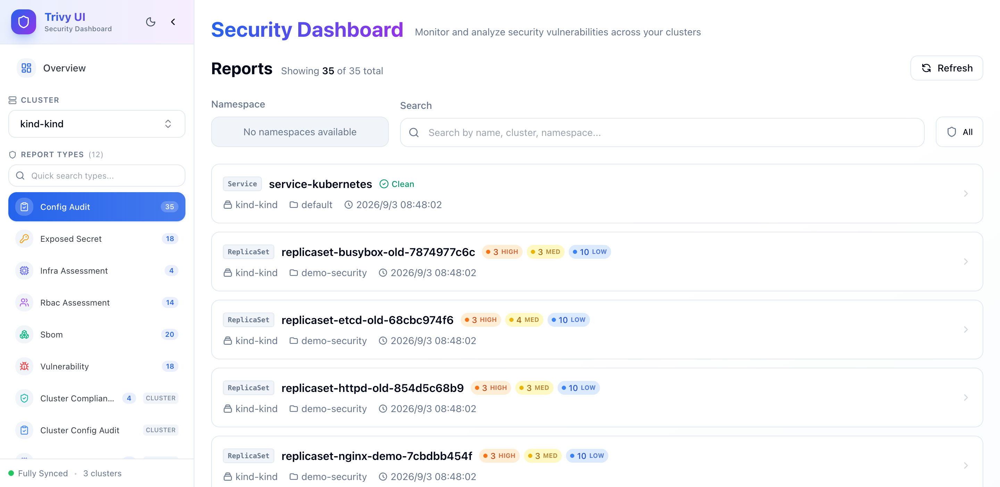

# Dashboard features and navigation

The Trivy UI Dashboard provides a web-based interface for visualizing, filtering, and analyzing security scan results generated by the Trivy Operator across Kubernetes clusters.

## Navigation and sidebar

The left navigation sidebar is designed for fast triage across security domains:

### 1. Resizable sidebar width
- **Drag to resize**: Hover over the right border of the sidebar; the cursor changes to `col-resize`. Click and drag left or right to adjust the sidebar width between **220px and 480px**.
- **Double-click to reset**: Double-click the resize handle at any time to instantly restore the default width (280px).
- **Persistent width**: Your preferred sidebar width is stored in browser `localStorage` (`trivy-ui-sidebar-width`) and maintained across sessions and page reloads.

### 2. Collapsible sidebar
- Click the collapse arrow (`<`) at the top of the sidebar to switch to a compact, icon-only navigation bar.
- In collapsed mode, hover over any icon to view its full title and report count in a tooltip.

### 3. Aqua Security semantic iconography
Every report type is mapped to standard security domain iconography with distinct colors for rapid identification:

| Report Type | Semantic Icon | Theme Color | Focus Area |
|---|---|---|---|
| **Vulnerabilities** | `Bug` | Red | CVEs and software package vulnerabilities |
| **Config Audit** | `ClipboardCheck` | Blue | Kubernetes manifest security misconfigurations |
| **Exposed Secret** | `KeyRound` | Amber | Leaked tokens, private keys, passwords, certificates |
| **Infra Assessment** | `Cpu` | Indigo | Kubernetes node, control plane, and core infra checks |
| **RBAC Assessment** | `Users` | Purple | ServiceAccount and ClusterRole privilege escalation |
| **SBOM** | `Boxes` | Emerald | Software Bill of Materials (SPDX / CycloneDX) |
| **Compliance** | `ShieldCheck` | Teal | CIS Benchmark, NSA, PCI-DSS compliance audits |

### 4. Quick type search
When your cluster has many CRD types (more than 8 types discovered), an inline search input (`Quick search types...`) appears at the top of the report type list. Typing letters instantly filters the navigation list, preventing cutoff on smaller screens.

### 5. Persistent Overview button
Click the **Overview** button (`LayoutDashboard` icon) at the top of the sidebar at any time to return to the cluster summary dashboard.

---

## Cluster Overview dashboard

When a cluster is selected, the main view defaults to the Cluster Overview dashboard:

### Top severity metric cards
Displays total vulnerability counts categorized into **Critical**, **High**, **Medium**, and **Low**:
- Values are formatted with thousand separators (e.g. `1,579`).
- Color-coded backgrounds and badges indicate severity volume at a glance.

### Equal-height trend and scan breakdown
- **30-Day Trend Chart**: Responsive area chart plotting historical volume for Critical and High vulnerabilities over the last 30 days.
- **Scan Breakdown Matrix**: Symmetrically aligned with the trend chart:
  - Each report type is shown with its formatted title, semantic icon, pass rate badge, and progress bar.
  - Displays total resources scanned versus resources with failures.
  - Equipped with an independent scrollbar to keep layout proportions balanced regardless of how many CRD types exist.

### Risk density and top vulnerable workloads
- **Top Vulnerable Workloads**: Highlights the most vulnerable Kubernetes workloads (Pods, Deployments, ReplicaSets) sorted by Critical and High findings, with direct one-click navigation to the report.
- **Namespace Risk Density / Leaderboard**: Ranks namespaces by vulnerability density to help operators prioritize remediation.

---

## Reports list and filtering

Selecting any report type from the sidebar opens the paginated reports list:

### Filter bar controls
1. **Namespace selector**: Multi-select dropdown to filter reports by one or more Kubernetes namespaces.
2. **Search bar**: Real-time filtering matching report name, cluster name, namespace, or container image repository.
3. **Issue toggle (`All` vs `Issues only`)**:
   - `[ 🛡 All ]`: Shows all scanned reports, including clean components.
   - `[ ⚠️ Issues only ]`: Filters the list to show only reports containing one or more vulnerabilities or audit failures.

### Report cards
Each report card provides concise, actionable metadata:
- **Workload kind badge**: Extracted workload type (`[Service]`, `[ReplicaSet]`, `[Deployment]`, `[DaemonSet]`, `[CronJob]`, `[Pod]`).
- **Severity indicators**: Compact level pills (`● 3 CRIT`, `● 10 HIGH`, `● 20 MED`, `● 5 LOW`).
- **Clean indicator**: Reports with zero security findings display a green `[ ✓ Clean ]` badge.
- **Cluster & namespace shortcuts**: Click the cluster or namespace badge to copy its name to the clipboard.
- **Share report link**: Hover over the card and click the share icon to copy the direct URL.
- **Drill-down cue**: Click anywhere on the card to open the complete report detail drawer.

---

## Report details drawer

Clicking any report opens the comprehensive report detail drawer:

- **Vulnerabilities tab**:
  - CVE ID (with primary link to NVD / vendor advisory).
  - Severity level badge (Critical, High, Medium, Low).
  - Target package name and installed version.
  - Fixed version (when available).
  - CVSS v3 score and vector.
  - Detailed vulnerability description.
- **Configuration audit tab**:
  - Check ID and rule title.
  - Status (`PASS` or `FAIL`).
  - Severity and category.
  - Detailed remediation guidance and suggested manifest fixes.
- **Exposed secrets tab**:
  - Rule ID, category, and severity.
  - File path and line numbers within the container image.
  - Masked snippet preview of the leaked secret.

---

## Live polling and background lifecycle

Trivy UI automatically stays synchronized with your Kubernetes clusters:

- **15-second report refresh**: The reports list automatically checks for newly generated Trivy reports every 15 seconds.
- **15-second counter refresh**: Sidebar badge counts update every 15 seconds.
- **30-second metadata refresh**: Cluster and CRD availability updates every 30 seconds.
- **Background tab sleeping**: When you minimize your browser or switch to another tab (`document.visibilityState === "hidden"`), all automatic polling requests **immediately pause** to conserve workstation battery and network bandwidth. When you switch back to the tab, the dashboard refreshes immediately.

---

## Theme support

Trivy UI features built-in **Dark Mode** and **Light Mode**:
- Toggle themes using the sun/moon icon in the top header.
- Themes adapt all chart colors, badges, and text contrast to ensure optimal readability in any lighting environment.
